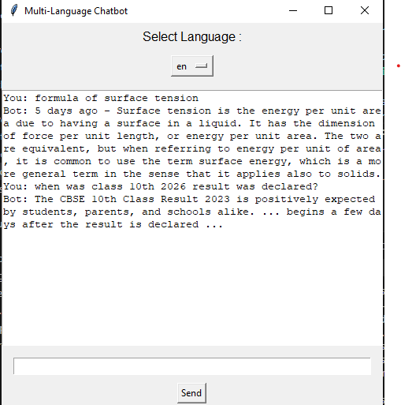

# 🌐 Multi-Language Chatbot with Real-Time Web Search



---

## 🚀 Overview

A **Python-based multi-language chatbot** that combines rule-based responses with **real-time web search** to handle both predefined and unknown queries.
The application features a **GUI interface**, automatic **language translation**, and a **fallback mechanism** using DuckDuckGo search.

---

## ✨ Key Features

* 🌍 Supports multiple languages (English, Hindi, Spanish)
* 💬 JSON-based chatbot for predefined responses
* 🔎 Real-time web search using DuckDuckGo (DDGS)
* 🔄 Automatic translation (input & output)
* 🖥️ Interactive GUI using Tkinter
* ⚡ Fallback system for unknown queries

---

## 📌 Key Highlights (Resume-Oriented)

* Developed a **multi-language chatbot** using Python and Tkinter
* Implemented a **hybrid response system** (rule-based + live search)
* Integrated **DuckDuckGo API (DDGS)** for dynamic query handling
* Built a **translation pipeline** for cross-language communication
* Designed a **modular architecture** (GUI, logic, APIs separated)

---

## 🧠 How It Works

1. User enters a query in any supported language
2. Input is translated to English
3. Bot checks responses in `responses.json`
4. If not found → fetches answer from DuckDuckGo
5. Response is translated back to user’s language

---

## 🛠️ Tech Stack

* **Python**
* **Tkinter**
* **JSON**
* **deep-translator**
* **ddgs (DuckDuckGo Search API)**

---

## 📂 Project Structure

```text id="struct1"
multi-language-chatbot/
│── main.py
│── requirements.txt
│── README.md
│── .gitignore
│
├── gui/
│   └── chatbot_gui.py
│
├── utils/
│   ├── translation_api.py
│   ├── response_logic.py
│   └── search_api.py
│
├── data/
│   └── responses.json
```

---

## ⚙️ Installation & Setup

### 1️⃣ Clone the repository

```bash id="clone1"
git clone https://github.com/sandhyagoswami30/multi-language-chatbot.git
cd multi-language-chatbot
```

### 2️⃣ Create virtual environment

```bash id="venv1"
python -m venv venv
venv\Scripts\activate
```

### 3️⃣ Install dependencies

```bash id="install1"
pip install -r requirements.txt
```

---

## ▶️ Run the Application

```bash id="run1"
python main.py
```

---

## 💡 Example Queries

* hello
* how are you
* what is artificial intelligence
* what is surface tension

---

## ⚠️ Limitations

* Depends on keyword matching for JSON responses
* Web results may vary in accuracy
* Not a fully AI-based chatbot (hybrid approach)

---

## 🚀 Future Enhancements

* Integrate LLM (ChatGPT-like responses)
* Voice input/output
* Web-based UI (FastAPI / React)
* Better intent recognition

---

## 👩‍💻 Author

**Sandhya Goswami**

---

## ⭐ Support

If you found this project useful, give it a ⭐ on GitHub!
